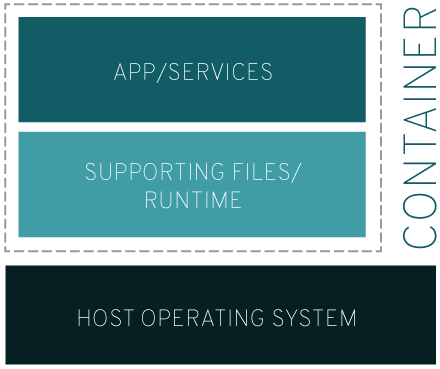
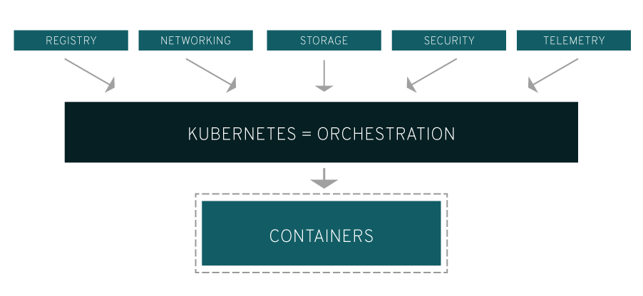

# O que são containers?

Um container é um conjunto de um ou mais processos organizados isoladamente do sistema. Todos os arquivos necessários à execução de tais processos são fornecidos por uma imagem distinta. Na prática, os containers Linux são portáteis e consistentes durante toda a migração entre os ambientes de desenvolvimento, teste e produção. Essas características os tornam uma opção muito mais rápida do que os pipelines de desenvolvimento, que dependem da replicação dos ambientes de teste tradicionais.

Fonte: https://www.redhat.com/pt-br/topics/containers/whats-a-linux-container

# O que é Docker?

Uma ferramenta de código aberto que facilitou o uso da tecnologia de containers.

# Demo Docker

TODO

# O que é Kubernetes

O Kubernetes é uma plataforma open source que automatiza as operações dos containers Linux. Essa plataforma elimina grande parte dos processos manuais necessários para implantar e escalar as aplicações em containers. Em outras palavras, se você desejar agrupar em clusters os hosts executados nos containers Linux, o Kubernetes ajudará a gerenciar esses clusters com facilidade e eficiência. Esses clusters podem abranger hosts em clouds públicas, privadas ou híbridas.

# Por que o Kubernetes é essencial?

Aplicações de produção abrangem múltiplos containers. que devem ser implantados em vários hosts do servidor. O Kubernetes oferece os recursos de orquestração e gerenciamento necessários para implantar containers em escala para essas cargas de trabalho. Com a capacidade de orquestração do Kubernetes, é possível criar serviços de aplicações que abrangem múltiplos containers, programar o uso desses containers no cluster, escalá-los e gerenciar a integridade deles com o passar do tempo.

Também é necessário integrar o Kubernetes com os serviços de rede, armazenamento, segurança, telemetria e outros para oferecer uma infraestrutura de containers global.

Fonte: https://www.redhat.com/pt-br/topics/containers/what-is-kubernetes

# Demo Kubernetes

TODO